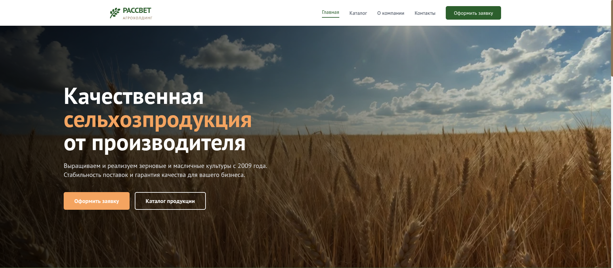
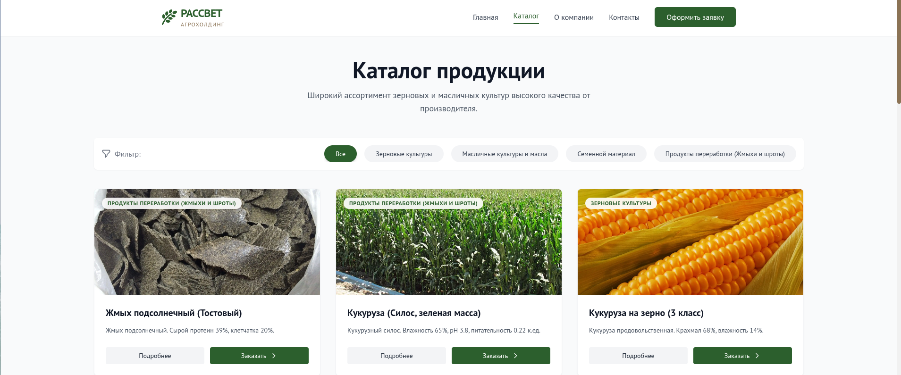
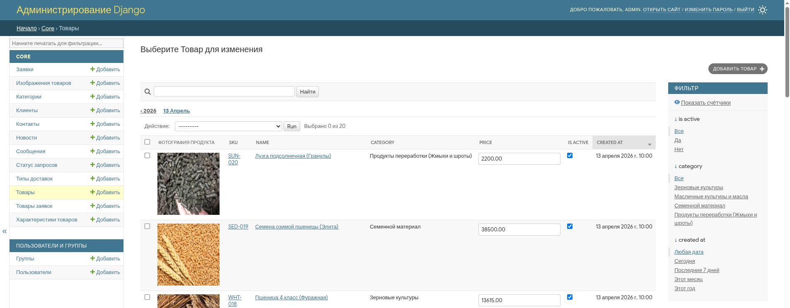

# Рассвет 🌾

Веб-сайт для сельскохозяйственного предприятия, оптом продающего зерно и масло, с автоматизацией оформления оптовых заявок и административной панелью.

> **Назначение:** интернет-представительство компании и автоматизация документооборота с оптовыми покупателями.

## 📋 Описание

Корпоративный сайт на Django с полноценным backend. Проект включает каталог продукции, новостной раздел, форму обратной связи и модуль оформления оптовой заявки, по итогам которой автоматически формируется товарная накладная и направляется на электронную почту обеих сторон.

## 🛠 Технологический стек

### Backend


- **Django** — серверная логика, маршрутизация, ORM, работа с формами и административная панель
- **Gunicorn** — WSGI-сервер для запуска приложения в production
- **WhiteNoise** — обслуживание статических файлов
- **python-docx** — генерация товарной накладной в формате `.docx`
- **Resend** — отправка уведомлений и документов на электронную почту организации через REST API с использованием официального Python SDK

### Frontend


- **HTML5 / Tailwind CSS / JavaScript** (Vanilla JS)
- **Figma** — разработка дизайн-макета
- Адаптивная вёрстка под мобильные устройства

### Database & Storage


- **PostgreSQL** (Neon) — хранение данных о товарах, категориях, заявках, новостях и контактах
- **Cloudinary** — хранение и доставка изображений и сгенерированных накладных

### Tools & Environment


- **Render** — облачный хостинг приложения
- **Git / GitHub** — контроль версий и хранение исходного кода

## ✨ Функциональность

### Публичная часть
- 🏠 **Главная страница** с информацией о компании и преимуществами
- 🛍️ **Каталог продукции** — категории, карточки товаров с характеристиками и изображениями
- 📰 **Раздел новостей** компании
- 📞 **Страница контактов** с формой обратной связи
- 📝 **Оформление оптовой заявки** — реквизиты компании, состав заказа, условия доставки
- 📄 **Автогенерация накладной** (`.docx`) с отправкой на e-mail покупателя и организации

### Административная панель
- 🔐 **Аутентификация** администратора через стандартный механизм Django
- ➕ **CRUD операции** для товаров, категорий, новостей и заявок
- 📤 **Загрузка изображений** товаров напрямую через интерфейс панели
- 🎨 Настроенный интерфейс управления ключевыми таблицами (товары, заявки)

## 🗂 Структура проекта
```
rassvet/
├── config/                  # Конфигурация проекта
│   ├── settings.py          # Настройки Django
│   ├── urls.py              # Корневые URL-адреса
│   └── wsgi.py / asgi.py
├── core/                    # Основное приложение
│   ├── services/
│        ├── email_services.py   # Отправка email
│        ├── file_services.py    # Получения накладной
│        ├── order_services.py   # Обработка заявки
│   ├── models.py              # Модели БД
│   ├── views.py               # Представления (views)
│   ├── urls.py                # URL-адреса приложения
│   ├── admin.py               # Административная панель
│   ├── utils.py               # Генерация накладной
│   ├── signals.py             # Сигналы Django
│   └── templates/             # HTML-шаблоны
├── static/                  # CSS, JS, изображения
├── media/                   # Пользовательские медиафайлы
├── templates/docs/          # Шаблон накладной (.docx)
└── manage.py
```

## 🗄 Модели данных

### Product (Товар)
```python
- id: int
- sku: str
- name: str
- slug: str
- price: Decimal
- category_id: int (FK)
- description: str
- short_description: str
- image: str
- is_active: bool
- created_at: datetime
- updated_at: datetime
```

### Client (Клиент)
```python
- id: int
- company_name: str
- tin: str
- legal_address: str
- created_at: datetime
```

### Request (Заявка)
```python
- id: int
- code: str
- client_id: int (FK)
- contact_id: int (FK)
- delivery_type_id: int (FK)
- delivery_address: str
- total_price: Decimal
- comment: str
- waybill_url: str
- created_at: datetime
```

### RequestItem (Позиция заявки)
```python
- id: int
- request_id: int (FK)
- product_id: int (FK)
- quantity: int
- price: Decimal
```

## 🔐 Безопасность

- **Серверная и клиентская валидация** форм обратной связи и оформления заявки
- **Аутентификация** доступа к административной панели
- **Переменные окружения** (.env) для хранения чувствительных данных (база данных, SMTP, Cloudinary)

## 📦 Установка и запуск

1. **Клонировать репозиторий**
```bash
   git clone https://github.com/<username>/rassvet.git
   cd rassvet
```

2. **Создать виртуальное окружение**
```bash
   python -m venv venv
   source venv/bin/activate  # Linux/Mac
   venv\Scripts\activate     # Windows
```

3. **Установить зависимости**
```bash
   pip install -r requirements.txt
```

4. **Настроить .env файл**
```bash
   cp .env.example .env
   # Заполнить переменные окружения: DATABASE_URL, CLOUDINARY_URL, EMAIL_HOST_*
```

5. **Применить миграции и запустить сервер**
```bash
   python manage.py migrate
   python manage.py loaddata initial_data.json
   python manage.py runserver
```

Приложение будет доступно по адресу: `http://localhost:8000`

Административная панель: `http://localhost:8000/admin`

## 🎨 Дизайн

### Сайт



### Каталог товаров



### Админ панель



[Макет в Figma](https://www.figma.com/design/eAcvGEnaQEDuJ0XoTVTAok/ooorasvet?node-id=43-2&p=f&t=7EWxGJ9L2aQ9CdVv-0)

## 🏗 Архитектурные решения

- **Оптимизация запросов через `prefetch_related`** — устранение проблемы N+1 при выводе каталога со связанными изображениями и категориями
- **Программная генерация документов** — накладная собирается из данных заявки в момент её создания, без шаблона с ручным заполнением
- **Заменяемые внешние зависимости** — хранилище, почта и БД подключены через стандартные механизмы Django, провайдера можно сменить через конфиг
- **Оптимизация фронтенда** — изображения в `.webp`, минифицированный CSS
- **Фикстуры и миграции** — справочные данные (категории, типы доставки) разворачиваются автоматически при первом запуске

## 📝 Возможности для расширения

- [ ] Асинхронная отправка email и генерация накладной (Celery)
- [ ] REST API для заявок — задел под мобильный клиент или интеграцию с 1С
- [ ] Покрытие тестами бизнес-логики и генератора документов
- [ ] Статусная модель заявки (новая → в обработке → подтверждена)
- [ ] Пагинация и расширенная фильтрация в каталоге

## 📄 Лицензия

Дипломный проект
